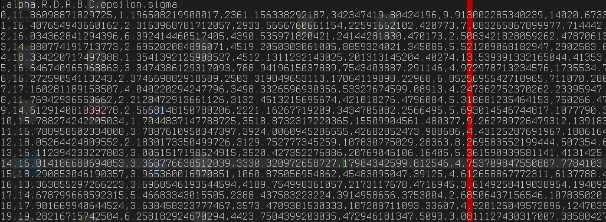
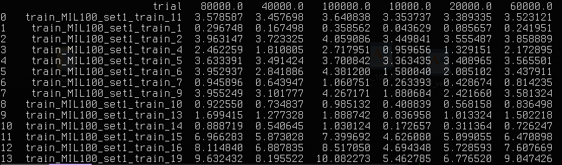
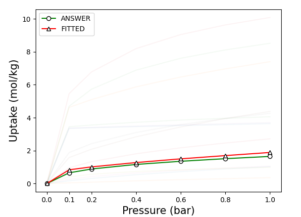

# Bayesian optimzation

 마지막 수정 : 2021-05-26

[TOC]

## [개요]

- RASPA 데이터 fitting 관련 문제를 해결하기 위해, bayesian 최적화를 공부해봤음
  - https://github.com/fmfn/BayesianOptimization 여기 github을 참고하였음
- `Inputs`에서 `Outputs`로 가는 어떤 Black Box function이 있을 때, 주어진 범위 내에서 그 함수의 maximum 지점을 찾기 위해 사용 됨.
- 결론적으로 최적화 방법론이기 때문에 아래 두 가지 방법론과 비교해서 주로 설명 됨
  - Manual search (Random search)
    - 알려져 있 듯, 사람의 insight에 의존하여 소위 "찍는" 방법
    - 불필요한 탐색이 많아질 수 있다는 단점을 가지고 있음
  - Grid search
    - 일정 간격 별로 Inputs를 테스트하는 방식
    - 간격이 좁아질수록, 또 차원이 커질수록 비용이 급증하게 되는 단점이 있다
- Bayesian 최적화 기법이란 결국 위에 언급된 단점들을 해결하기 위한 것으로 
  - 불필요한 탐색을 줄이고 파라미터 수가 많아지더라도 어느 정도 보장된 성능을 보인다.
  - 최소한의 탐색 안에 maximum (또는 조건 충족하는 input-output 쌍)을 찾기 위한 수법
- Searching한 space를 기반으로 Black Box function에 대한 예측 함수를 도출하고 이를 통해
  - 무엇이 maximum을 줄 input인지
  - 어디를 탐색해야 Black box function에 더 가까운 예측 함수를 새로 도출할 수 있을 지 추천해 준다.

## [본문]

### 1.  기본적인 사용법

- 파이썬으로 하였고, 아래 라이브러리를 사용하였다

  ~~~python
  from bayes_opt import BayesianOptimization
  ~~~

- 최적화 문제답게, 유추할 `black box function`과 `input의 범위`를 지정해주어야한다.

  ~~~python
  # 물론 아래처럼, black-box function을 바로 수학적으로 알 수 있는 경우는 bayesian 쓸 때는 거의 없지.
  def black_box_function(x, y):
      return -x ** 2 -(y-1) ** 2 + 1
  
  pbounds = {'x': (2, 4), 'y': (-3, 3)}
  ~~~

- 그 후, `optimizer` 객체를 조건과 함께 생성해주고, `maximize` 메서드를 조건과 함께 사용

  ~~~python
  optimizer = BayesianOptimization(
  	f=black_box_function,  # black box function 알려주기
  	pbounds=pbounds,  # input 범위 적용
  	verbose=2,  # if 1, prints only when a maximum is observed, 0 is silent
  	random_state=1,  # random seed
  )
  
  optimizer.maximize(
      init_points=2,
      n_iter=3,
  )
  # n_iter: how many steps of bayesian optimization u want to perform
  # 즉 여기는 사이클 같은 개념이고
  # init_points: how many steps of random exploration u want to perform
  # 여기는, random point를 디그하는 느낌이네.
  
  print(optimizer.max)  # 참고로 maximize 밖에 안되는 거 같다.
  ~~~

- 다음 포인트 예측은 아래처럼 해주면 된다.

  ~~~python
  from bayes_opt import UtilityFunction
  utility = UtilityFunction(kind='ucb', kappa=2.5, xi=0.0)  # ucb는 acquisition function의 일종, kappa랑 xi도 옵션인데 얼마나 대담하게 예측할 지 등등과 관련된 것들
  
  next_point_to_probe = optimizer.suggest(utility)
  print("Next point to probe is: ", next_point_to_probe)
  target = black_box_function(**next_point_to_probe)
  print("Found the target value to be: ", target)
  
  optimizer.register(
      params=next_point_to_probe,
      target=target,
  )
  ~~~

  - 근데 register 안써도, 아래 나오겠지만 probe 하도록 저장한 다음에 `maximize` method 써도 되는 거 같음

### 2. 그 외 필요할 거 같은 기능들

- `input`범위 바꾸기

  ~~~python
  optimizer.set_bounds(new_bounds={'x': (-2, 3)})
  ~~~

- 특정 input 값들을 강제로 확인하게 하기

  ~~~python
  optimizer.probe(
  	params={'x': 0.5, 'y': 0.7}  # x가 0.5이고 y가 0.7인 지점을 optimizer가 확인하게 함
      lazy=True,  # maximize 메서드가 호출되면 위의 저장된 input 확인
  )
  ~~~

- `log` 저장 및 불러오기

  ~~~python
  from bayes_opt.logger import JSONLogger
  from bayes_opt.event import Events
  from bayes_opt.util import load_logs
  
  logger = JSONLogger(path="./logs.json")
  optimizer.subscribe(Events.OPTIMZATION_STEP, logger)  # logger에 optimization 이벤트 저장
  
  print("start record")
  optimizer.maximize(
      init_points=2,
      n_iter=3,
  )
  
  new_optimizer = BayesianOptimization(
      f=black_box_function,
      pbounds={'x': (-2, 2), 'y': (-2, 2)},
      verbose=2,
      random_state=7,
  )
  print(len(new_optimizer.space))
  load_logs(new_optimizer, logs=["./logs.json"])  # new optimizer가 log 정보를 읽어옴
  print(f"New optimizer is now aware of {len(new_optimizer.space)} points")
  ~~~

  

  

### 3. 내 연구에 적용한 방법

- raspa 계산에서의 fitting 연구를 한 것이기 때문에 나의 경우

  > `input`: forcefield parameters,  `output`: raspa output at pressure 0.1 ~ 1bar

- 아래는 초기에 테스트 해 볼 ff parameter set을 csv 파일로 뽑아둔 것 (20가지의 경우)

  

- 그에 따른 raspa 계산 결과 (계산이 아직 진행 중이라 20개가 되지 않음)

  

- Bayesian의 경우엔 아래와 같이 적용하였음

  ~~~python
  # 결과의 값에서 맞추고자 하는 정답 값과의 차이를 구함. 
  # 제곱을 통해 양수로 바꾸고, maximize 메소드를 쓰기 위해 역수를 취해줌
  def objective(A, B, C, epsilon, sigma):
      diff = np.array(ANSWER) - result_map[(A, B, C, epsilon, sigma)]
      obj = np.sum(np.square(diff))
      return 1/obj
  
  # 탐색할 지점들을 가지고 있는 정보들로 강제 지정해주는 부분
  # 큰 구조라서 raspa계산 하나하나가 오래 걸리기 때문에, 임의의 지점을 하나씩 받는 것이 어렵기 때문에 이렇게 하였음
  for key, value in result_map.items():
      vars = ['A', 'B', 'C', 'epsilon', 'sigma']
      optimizer.probe(
          params=dict(zip(vars, key)),
          lazy=True,
      )
  optimizer.maximize(init_points=0, n_iter=0)
  
  # 아래는 새로 탐색해볼 추천 리스트를 받는 것
  candidate_l = []
  for _ in range(10):
      kind = random.choice(['ucb', 'ei', 'poi'])  # 어떤 함수가 좋은 지 몰라서, 그냥 random하게
      kappa = random.choice([2.5, 5])
      utility = UtilityFunction(kind=kind, kappa=kappa, xi=0.0)
      next_point_to_probe = optimizer.suggest(utility)
      # print("next: ", next_point_to_probe)
      ## fill in here
      candidate_l.append(list(next_point_to_probe.values()))  # suggest 자체에도 random seed가 있어서 이렇게 해도 추천이 안겹침
  # print(candidate_l)
  df = pd.DataFrame(np.array(candidate_l), columns=['A', 'B', 'C', 'epsilon', 'sigma'])
  df.to_csv(write_file)
  ~~~

- Iteration을 반복하다보니 나름 잘 찾아가는 모습

  

## [비고]

- Bayesian 최적화 기법에 대한 세부적인 공부가 부족해서 아직 더 공부해 볼 예정.
- https://github.com/fmfn/BayesianOptimization 여기에 나와있는 거 처럼 시각화도 좀 할 수 있으면 발표할 때 좋을 거 같음

